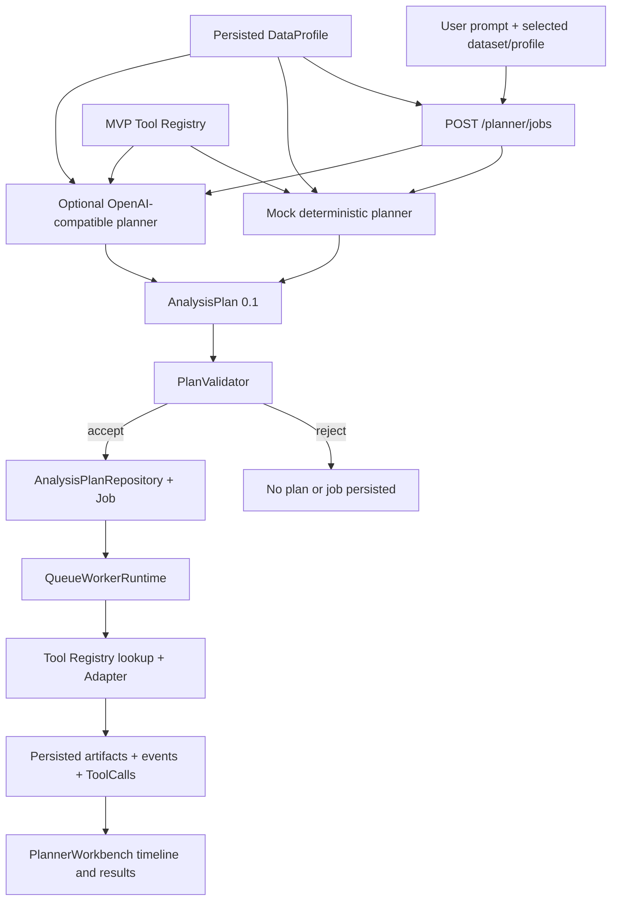

# Phase 10L-0 Current Planner Architecture

Status: implementation-grounded audit snapshot at baseline `17de1f91cef6e94a5a1f4ae684fb3e1b756f0906`.

## File Map

| Component | File | Current responsibility |
|---|---|---|
| Planner HTTP boundary | `apps/api/mdi_api/routers/planner.py` | Selects a provider, obtains a Profile, generates and validates a plan, persists it, creates a job, and optionally enqueues it. |
| Mock Planner | `services/llm/mdi_llm/providers.py` | Deterministic ordered routing predicates and plan builders. |
| LLM Planner | `services/llm/mdi_llm/providers.py` | Optional OpenAI-compatible JSON completion transport. |
| Prompt builder | `services/llm/mdi_llm/planner_prompt.py` | Serializes a shallow Profile summary and the MVP tool list. |
| AnalysisPlan and ToolCall | `packages/schemas/mdi_schemas/models.py` | Pydantic contracts for plans, steps, expected artifacts, and persisted execution calls. |
| PlanValidator | `packages/tool-registry/mdi_tool_registry/plan_validator.py` | Strict schema, Registry allowlist, stage, credential-key, and params-schema validation. |
| Tool Registry | `packages/tool-registry/mdi_tool_registry/loader.py` | Normalizes manifests into execution metadata and resource limits. |
| Queue runtime | `services/workers/mdi_workers/queue_runtime.py` | Loads a persisted plan and executes its steps sequentially through registered adapters. |
| Persistence | `apps/api/mdi_api/repositories.py` | Stores canonical plan JSON, hash, provider, job binding, events, calls, and artifacts. |
| Planner UI | `apps/web/app/components/PlannerWorkbench.tsx` | Creates and immediately enqueues a job, then displays plan, timeline, calls, and artifacts. |

## Current Flow



The DataProfile path is asymmetric. The Mock Planner directly reads selected
Profile 2.0 semantic groups and readiness. The LLM prompt receives only dataset
and profile IDs, table column names, structure count/elements, input-ref hints,
and a quality-issue count. PlanValidator receives no DataProfile.

## AnalysisPlan Contract

| Concern | Current behavior |
|---|---|
| Schema | `AnalysisPlan`, `schemaVersion = 0.1` |
| Goal | `goal` normally stores the raw user prompt |
| Data binding | Required `datasetId` and `profileId` strings |
| Steps | Non-empty ordered `AnalysisStep[]`; unique `stepId` enforced |
| Dependencies | No `dependsOn`, graph, or dependency condition |
| Inputs | Dataset/profile/normalized-object/dataframe-column/artifact ref types are syntactically available |
| Prior-step artifact binding | No producer-step/output identity and no runtime artifact injection |
| Outputs | Per-step artifact type list plus plan-level expected artifact descriptors |
| Provider metadata | Repository records provider name, but not model, prompt version, temperature, or full provider configuration |
| Persistence | Validated canonical JSON and SHA-256 plan hash are saved before execution and bound to one job |
| Mutation/versioning | No plan edit/revision API; schema version is fixed at `0.1` |

## Multi-Tool Reality

Classification: **SEQUENTIAL_INDEPENDENT**.

The schema and validator accept multiple ordered steps. QueueWorkerRuntime runs
each step in list order and persists every step's ToolCall and artifacts. The
phonon-band/BZ linked-view route proves two steps execute. The steps consume
independently pre-existing objects; neither consumes an artifact produced by
the other. Therefore this is not dependency-aware planning and not a DAG.

On a step failure, already persisted artifacts remain, the current ToolCall is
marked failed, later steps do not run, and the whole job becomes failed. There
is no job-level cancellation check, retry policy, partial-success policy, or
automatic plan repair in this runtime path.

## Runtime Authority

The execution boundary remains correct:

```text
Planner -> validated/persisted AnalysisPlan -> QueueWorkerRuntime
        -> Tool Registry lookup -> registered Adapter -> inert artifacts
```

Neither planner provider can directly execute Python, shell, filesystem, or
scientific-library operations. The optional live provider can only return JSON
for validation. The default provider is the no-network Mock Planner.

## Frontend Reality

The UI shows selected dataset/Profile, prompt, generated steps, validation
errors, plan ID/hash, events, ToolCalls, artifacts, reports, and recipes. The
primary action calls `/planner/jobs` with `enqueue: true`, so the visible plan
is available only after job creation/enqueue. There is no pre-execution user
approval, plan editing, same-job retry, cancellation action, clarification
state, or conversation-history input. The run button creates a new job.
