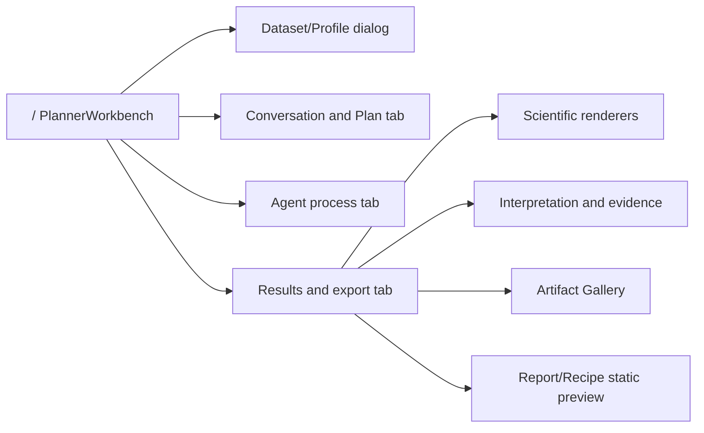

# Current Page, Route, and Component Map

## Route inventory

| Page/surface | Route | Entry | Required state | Main components | APIs | Historical reload | Mobile | Status |
|---|---|---|---|---|---|---|---|---|
| Analysis entry | `/` | direct | none | GlobalContextBar, DataContextShell, MainWorkspaceTabs | health, datasets, providers | no | stacked shell | READY |
| Dataset entry | `/` dialog | dataset button | project context | DatasetCommandDialog | datasets/profile/upload | datasets only | dialog | READY |
| Intent/clarification | `/` plan tab | submit | dataset/Profile | AnalysisIntentPanel | planner jobs/clarification | no | stacked | READY |
| Plan/capability | `/` plan tab | ready Intent | decision | CapabilityPlanningPanel, PlanPreviewPanel | planner jobs/plan | no | stacked | READY |
| Job/timeline | `/` agent tab | created Job | jobId in memory | AgentTimeline | Job/events/SSE | exact ID API only | stacked | READY foundation |
| Dependency | `/` plan/results | Plan 0.2 | dependency audit | DependencyExecutionPanel | dependencies | exact ID API only | cards | READY foundation |
| Artifacts/results | `/` results tab | selected chunk | artifacts | renderers, ArtifactGallery | artifact metadata/content | exact ID API only | stacked | PARTIAL unified |
| Interpretation | `/` results tab | terminal Job | plan hash | GroundedInterpretationPanel | interpretation/evidence | exact ID API only | stacked | READY foundation |
| Report/Recipe | `/` results tab | generated artifacts | report/recipe artifact | ReportRecipeSummaryPanel | artifact APIs | no dedicated read | stacked | PARTIAL |
| History | absent | absent | project | absent | repository list methods only | no | absent | MISSING_10M |
| Workspace | absent | absent | persisted workspace | absent | absent | no | absent | MISSING_10M |
| Error/404 | Next default | invalid route | none | framework default | none | no | default | PARTIAL |

## Current relationship

## Current navigation limits

**CONFIRMED CURRENT LIMITATION**

- No route contains Job, Plan, Artifact, interpretation, panel, or selection identity.
- Browser back/forward does not represent tab or selection changes.
- Refresh loses active Job and all UI state.
- No user-visible history route exists.
- Artifact and evidence links are in-page state changes, not durable links.
